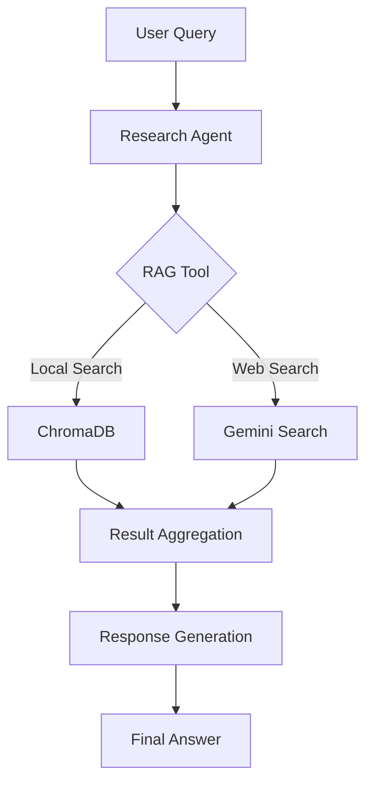

# Multi-Agent RAG

## Giới thiệu

Multi-Agent RAG là một hệ thống kết hợp giữa Retrieval-Augmented Generation (RAG) và Multi-Agent để tạo ra một giải pháp thông minh trong việc truy xuất và xử lý thông tin. Hệ thống này cho phép:

- Tìm kiếm thông tin từ nhiều nguồn (cơ sở dữ liệu local và web)
- Phân tích và tổng hợp thông tin một cách thông minh 
- Tự động chuyển đổi giữa các nguồn dữ liệu
- Cung cấp câu trả lời chính xác và toàn diện

## Core Agent types

- Reasearch Agent: Chuyên truy xuất tài liệu (RAG)
- Analysis Agent: Phân tích chuyên sâu, chuyên về lĩnh vực cụ thể, áp dụng các domain suy luận
- Sythesis Agent: Kết hợp multi Analysis Agent thành các phản ứng mạch lạc. Xử lý các thông tin mâu thuẫn, sai cú pháp.
- Quality Agent: Đánh giá đầu ra chính xác, đầy đủ và tuân thủ 

## Ưu điểm 

- Chia nhỏ nhiệm vụ, tối ưu hóa chuyên môn: Mỗi agent có thể đảm nhận một vai trò riêng: ví dụ, một agent chuyên retrieval, một agent chuyên tóm tắt, một agent chuyên reasoning. Giúp tăng chất lượng và độ chính xác của kết quả vì agent được “tập trung” vào nhiệm vụ cụ thể.
- Xử lý đa nguồn dữ liệu hiệu quả: Multi-Agent RAG có thể kết hợp các nguồn dữ liệu khác nhau (text, images, bảng biểu, API) thông qua các agent chuyên biệt, mà không làm rối một agent duy nhất.
- Tăng khả năng mở rộng: Có thể dễ dàng thêm agent mới cho các nhiệm vụ mới mà không cần viết lại toàn bộ pipeline.
- Khả năng giải thích tốt hơn: Khi có lỗi hoặc kết quả không chính xác, dễ truy vết xem agent nào đã xử lý phần nào, thuận tiện cho debugging và audit.

## Nhược điểm 

- Chi phí tính toán cao và phức tạp: Mỗi agent cần tài nguyên riêng (CPU/GPU, bộ nhớ), đặc biệt khi chạy nhiều agent song song hoặc xử lý dữ liệu lớn.
- Quản lý luồng dữ liệu khó khăn: Phải thiết kế cơ chế coordination và communication giữa các agent, nếu không có thể dẫn đến deadlock, lặp thông tin hoặc mất context.
- Latency cao hơn: Do nhiều agent phối hợp, thời gian từ query → retrieval → generation thường lâu hơn so với single-agent RAG.
- Khó debug và đồng bộ: Khi có nhiều agent hoạt động song song, lỗi có thể khó xác định nguồn gốc, nhất là khi agent tương tác phức tạp hoặc dựa trên context được truyền giữa nhiều agent.

## Kiến trúc hệ thống

### 1. Thành phần cốt lõi

#### 1.1 RAG System

**Vector Database (ChromaDB)**
- Lưu trữ và quản lý documents dưới dạng vectors
- Hỗ trợ tìm kiếm semantic similarity
- Persistence để lưu trữ lâu dài

**Retriever**
- Tìm kiếm documents liên quan dựa trên similarity search
- Hỗ trợ maximal marginal relevance để đảm bảo đa dạng kết quả
- Tích hợp với Vietnamese embeddings

#### 1.2 Multi-Agent System

**Research Agent**
- Vai trò: Chuyên gia tìm kiếm và phân tích thông tin
- Khả năng: Kết hợp thông tin từ nhiều nguồn
- Tools: RAGTool và GeminiGoogleSearchTool

**Task Management**
- Sequential processing cho các nhiệm vụ đơn giản
- Hierarchical processing cho các tác vụ phức tạp
- Task delegation và coordination

### 2. Luồng xử lý

### 3. Các công nghệ sử dụng

- **Vector Database**: ChromaDB
- **Embeddings**: AITeamVN/Vietnamese_Embedding
- **LLM Models**:
  - OpenAI GPT-3.5-turbo cho agent reasoning
  - Gemini cho web search
- **Framework**: LangChain và CrewAI

## Ưu điểm của Multi-Agent RAG

### 1. Tính linh hoạt
- Tự động chuyển đổi giữa local và web search
- Khả năng mở rộng với nhiều agents và tools

### 2. Độ chính xác cao
- Kết hợp nhiều nguồn thông tin
- Cross-validation giữa local và web data

### 3. Hiệu suất tối ưu
- Caching và vector search
- Parallel processing khi cần thiết

### 4. Khả năng mở rộng
- Dễ dàng thêm agents mới
- Tích hợp tools và nguồn dữ liệu mới

## Các trường hợp sử dụng

### 1. Tìm kiếm thông tin chuyên ngành
- Truy xuất tài liệu technical
- Kết hợp với thông tin mới từ web

### 2. Question Answering
- Trả lời câu hỏi dựa trên documents
- Bổ sung thông tin từ nhiều nguồn

### 3. Information Synthesis
- Tổng hợp thông tin từ nhiều nguồn
- Tạo báo cáo tổng quan

## Hướng phát triển

### 1. Mở rộng Agent System
- Thêm specialized agents
- Cải thiện coordination

### 2. Tối ưu RAG
- Cải thiện retrieval quality
- Thêm filtering và ranking

### 3. Tích hợp Advanced Features
- Real-time update
- Multi-language support
- Advanced caching

## Kết luận

Multi-Agent RAG là một giải pháp powerful cho việc xử lý và truy xuất thông tin thông minh, kết hợp ưu điểm của cả RAG và Multi-Agent systems để tạo ra một hệ thống linh hoạt và hiệu
