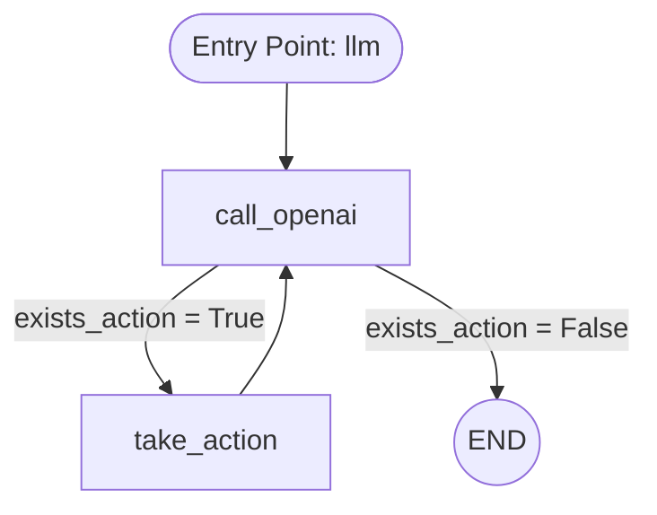

# Agentic RAG Demo

## Mục đích
Notebook này trình bày cách xây dựng một Agentic RAG (Retrieval-Augmented Generation) sử dụng LangGraph, LangChain, OpenAI, và các công cụ tìm kiếm bên ngoài. Agent có thể thực hiện truy vấn, gọi API, và trả lời dựa trên dữ liệu truy xuất được.

## Các thành phần chính
- **LangGraph**: Xây dựng đồ thị trạng thái cho agent.
- **LangChain**: Quản lý message, tool, và tích hợp LLM.
- **OpenAI**: Sử dụng mô hình GPT cho hội thoại và sinh câu trả lời.
- **SqliteSaver**: Lưu trạng thái agent và checkpoint.
- **Các tool**: Tích hợp API thời tiết, tìm kiếm arXiv, DuckDuckGo,...
## Flow Agent

## Hướng dẫn sử dụng
1. **Cài đặt thư viện**
   - Chạy cell đầu tiên:
     ```python
     !pip install langgraph langchain langchain-openai langgraph-checkpoint-sqlite feedparser pydantic python-dotenv requests langchain-community ipython
     ```
2. **Cấu hình API key**
   - Tạo file `.env` và thêm các key cần thiết, ví dụ:
     ```env
     OPENAI_API_KEY=your_openai_key
     OPENWEATHER_API_KEY=your_openweather_key
     ```
3. **Chạy các cell import và khởi tạo tool**
   - Đảm bảo các cell import và khởi tạo tool đều chạy thành công.
4. **Khởi tạo và chạy agent**
   - Agent sẽ nhận câu hỏi, truy vấn các tool, và trả lời dựa trên dữ liệu truy xuất.

## Ví dụ truy vấn
- "What is the weather of Hanoi?"
- "Search for machine learning papers on arXiv."
- "Who is the current president of the United States?"


## Liên hệ & đóng góp
- Tác giả: Hoàng
- Repo: https://github.com/viphoangdep/Rag_demo_paraline

---
Bạn có thể mở rộng thêm các tool hoặc tích hợp LLM khác theo nhu cầu.
