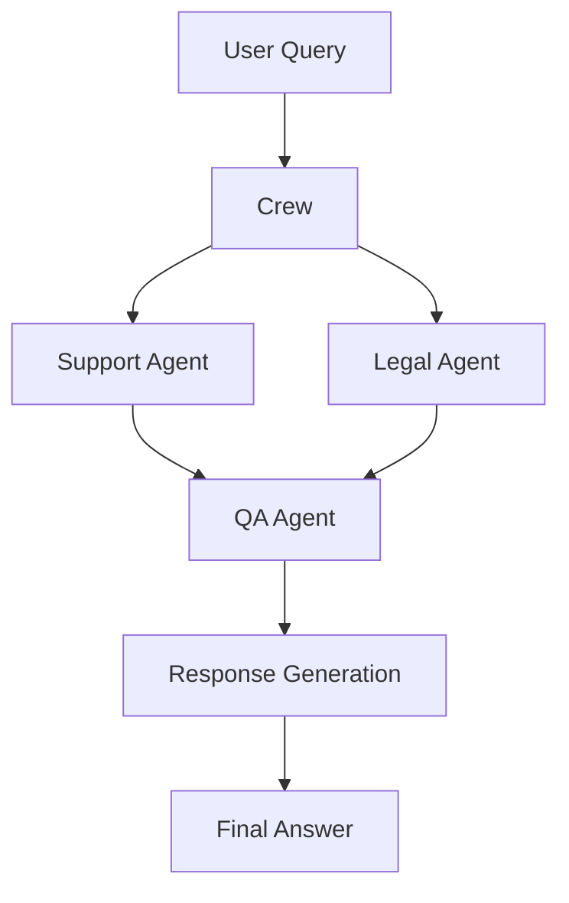

# Multi-Agent RAG Demo

## Mục đích
Notebook này trình bày cách xây dựng hệ thống Multi-Agent RAG (Retrieval-Augmented Generation) sử dụng CrewAI, LangChain, và các công cụ tìm kiếm. Hệ thống gồm nhiều agent chuyên trách các nhiệm vụ khác nhau như logistics, kiểm tra chất lượng, pháp lý... để hỗ trợ khách hàng hiệu quả và tiết kiệm chi phí.

## Thành phần chính
- **CrewAI**: Quản lý agent, task, và phối hợp các agent.
- **LangChain**: Tích hợp các tool tìm kiếm, scraping, và xử lý dữ liệu.
- **Các agent**:
   - Logistics Specialist: Tư vấn dịch vụ vận chuyển, tối ưu chi phí và thời gian.
   - QA Specialist: Kiểm tra chất lượng tư vấn, đảm bảo thông tin đầy đủ và chính xác.
   - Legal Agent: Tư vấn pháp lý, xử lý các vấn đề về hợp đồng, quy định, khiếu nại.
- **Các tool**: Google Search, SerperDev, ScrapeWebsiteTool, WebsiteSearchTool...
### Luồng xử lý hệ thống


## Hướng dẫn sử dụng
1. **Cài đặt thư viện**
   - Chạy cell đầu tiên:
     ```python
     !pip install crewai crewai_tools langchain_community python-dotenv
     ```
2. **Cấu hình API key**
   - Tạo file `.env` và thêm các key cần thiết, ví dụ:
     ```env
     OPENAI_API_KEY=your_openai_key
     SERPER_API_KEY=your_serper_key
     ```
3. **Khởi tạo agent và tool**
   - Định nghĩa các agent (Logistics Specialist, QA Specialist, Legal Agent) và các tool cần thiết.
4. **Tạo các task**
   - Mỗi task mô tả nhiệm vụ cụ thể cho từng agent (ví dụ: tư vấn giá vận chuyển, kiểm tra chất lượng, giải đáp pháp lý).
5. **Khởi tạo crew và chạy hệ thống**
   - Crew sẽ phối hợp các agent để giải quyết yêu cầu của khách hàng.

## Ví dụ truy vấn
- "Estimate the cost of shipping 6.8 tons from Ho Chi Minh to Ha Noi."
- "Provide any legal procedures for this shipping."
- "Review the logistics advice for completeness and accuracy."

## Lưu ý tối ưu chi phí
- Khi khách hàng hỏi về chi phí vận chuyển, agent chỉ lấy và xử lý thông tin liên quan, không truyền toàn bộ trang web vào LLM để tránh tốn chi phí.
- Agent pháp lý chỉ nên truy vấn và tóm tắt các quy định cần thiết, không gửi toàn bộ văn bản pháp luật vào LLM.

## Liên hệ & đóng góp
- Tác giả: Hoàng
- Repo: https://github.com/viphoangdep/Rag_demo_paraline

---
Bạn có thể mở rộng thêm agent hoặc tool theo nhu cầu thực tế.
