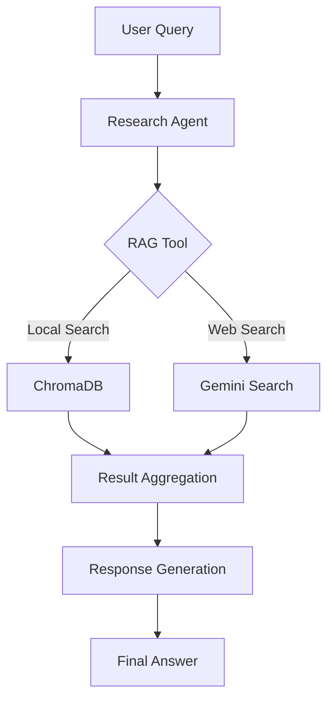

# Multi-Agent RAG

## Giới thiệu

Multi-Agent RAG là một hệ thống kết hợp giữa Retrieval-Augmented Generation (RAG) và Multi-Agent để tạo ra một giải pháp thông minh trong việc truy xuất và xử lý thông tin. Hệ thống này cho phép:

- Tìm kiếm thông tin từ nhiều nguồn (cơ sở dữ liệu local và web)
- Phân tích và tổng hợp thông tin một cách thông minh 
- Tự động chuyển đổi giữa các nguồn dữ liệu
- Cung cấp câu trả lời chính xác và toàn diện

## Kiến trúc hệ thống

### 1. Thành phần cốt lõi

#### 1.1 RAG System

**Vector Database (ChromaDB)**
- Lưu trữ và quản lý documents dưới dạng vectors
- Hỗ trợ tìm kiếm semantic similarity
- Persistence để lưu trữ lâu dài

**Retriever**
- Tìm kiếm documents liên quan dựa trên similarity search
- Hỗ trợ maximal marginal relevance để đảm bảo đa dạng kết quả
- Tích hợp với Vietnamese embeddings

#### 1.2 Multi-Agent System

**Research Agent**
- Vai trò: Chuyên gia tìm kiếm và phân tích thông tin
- Khả năng: Kết hợp thông tin từ nhiều nguồn
- Tools: RAGTool và GeminiGoogleSearchTool

**Task Management**
- Sequential processing cho các nhiệm vụ đơn giản
- Hierarchical processing cho các tác vụ phức tạp
- Task delegation và coordination

### 2. Luồng xử lý

### 3. Các công nghệ sử dụng

- **Vector Database**: ChromaDB
- **Embeddings**: AITeamVN/Vietnamese_Embedding
- **LLM Models**:
  - OpenAI GPT-3.5-turbo cho agent reasoning
  - Gemini cho web search
- **Framework**: LangChain và CrewAI

## Ưu điểm của Multi-Agent RAG

### 1. Tính linh hoạt
- Tự động chuyển đổi giữa local và web search
- Khả năng mở rộng với nhiều agents và tools

### 2. Độ chính xác cao
- Kết hợp nhiều nguồn thông tin
- Cross-validation giữa local và web data

### 3. Hiệu suất tối ưu
- Caching và vector search
- Parallel processing khi cần thiết

### 4. Khả năng mở rộng
- Dễ dàng thêm agents mới
- Tích hợp tools và nguồn dữ liệu mới

## Các trường hợp sử dụng

### 1. Tìm kiếm thông tin chuyên ngành
- Truy xuất tài liệu technical
- Kết hợp với thông tin mới từ web

### 2. Question Answering
- Trả lời câu hỏi dựa trên documents
- Bổ sung thông tin từ nhiều nguồn

### 3. Information Synthesis
- Tổng hợp thông tin từ nhiều nguồn
- Tạo báo cáo tổng quan

## Hướng phát triển

### 1. Mở rộng Agent System
- Thêm specialized agents
- Cải thiện coordination

### 2. Tối ưu RAG
- Cải thiện retrieval quality
- Thêm filtering và ranking

### 3. Tích hợp Advanced Features
- Real-time update
- Multi-language support
- Advanced caching

## Kết luận

Multi-Agent RAG là một giải pháp powerful cho việc xử lý và truy xuất thông tin thông minh, kết hợp ưu điểm của cả RAG và Multi-Agent systems để tạo ra một hệ thống linh hoạt và hiệu